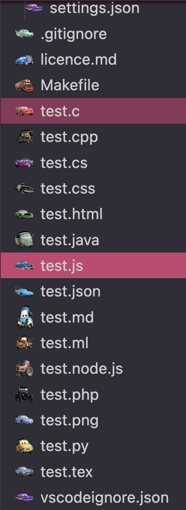

# cars-icon-theme

🏎️ A Cars themed icon pack

Icon theme made for the languages used in my compsci classes.

## Languages supported

For now, the supported languages are C, C++, C#, Java, Ocaml, Python, Y86, HTML, CSS, Javascript, Php, JSON, Markdown et LaTeX.

## Download

[Click here](https://marketplace.visualstudio.com/items?itemName=mchlln.vscode-cars-icon-theme) to find it in the VSCode Marketplace

## Resources

Inspired by the icon themes of [@kylap](https://github.com/klyap)
